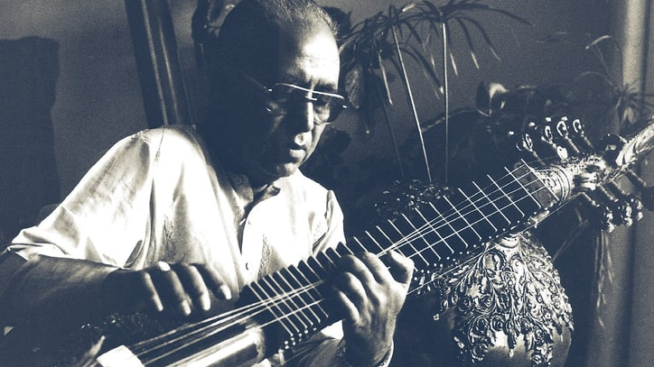

# The ancient Grāma system & the concept of Prāmana (standard) Shruti

(Ustad Z M Dagar in his natural state)

Generally speaking musical forms, styles, names & terminology change but there are certain
fundamental musical principals which never change i.e. the law of consonance or Samvāda.
Again the usage of the term Samvādi may change but the interval representing Samvadā or
consonance can never change i.e. the interval of Sa-Pa (fifth) and Sa-Ma (fourth) can never
change.

## Grāma system

The Grāma system which is based on the two main Sa-Pa & Sa-Ma Samvāda is the science of the
musical scales as developed by our seers.

The Grāma system can also be taken as the grammar of our musical scales that embodies certain
fundamental principals which hold good for all times and places.

Bharata, the earliest extend authority on our music, speaks of two Grāmas, Shadja-Grāma and
Madhyama-Grāma.

## Shadja-Grāma

Shadja-Grāma is based on Shadja-Pancham-Samvāda. All the notes in this Grāma have the
mutual Samvādi interval of Shadja-Pancham-Bhava which is thirteen shrutis interval or sa-pa, redha,
ga-ni, ma-sa.

The characteristic feature of Madhyama-Grāma is Reshab-Pancham-Samvāda.
This Re-Pa Samvāda is not there in Shadja-Grāma. Because Reshab is trishrutic in Shadja-Grāma,
it has a ten-shruti interval with Pancham and thus no Samvāda is possible.

## Madhyama-Grāma

In the Madhyama-Grāma however the Shadja-Pancham-Samvāda is violated by establishing
Reshab-Pancham Samvāda. In other words, the Pancham of Madhyama-Grāma is at 12 shruti
interval from Shadja which is not a Samvādi interval and thus it has a Samvādi interval of 9 shrutis
from Reshab.

In Shadja-Grāma we arrive at the perfect fifth and in Madhyama-Grāma we reduce this perfect
fifth so as to make it the perfect fourth of trishrutic Reshab.

## Prāmana Shruti

So now the difference between Pancham of Shadja-Grāma and that of Madhyama-Grāma
comprises the Prāmana Shruti or the standard shruti. In the mathematical calculation this
difference comes to 81/80.

This is Bharata’s simple method of arriving at the subtle interval of Prāmana Shruti through the
system of two Grāmas which are based on Samvāda or consonance.
