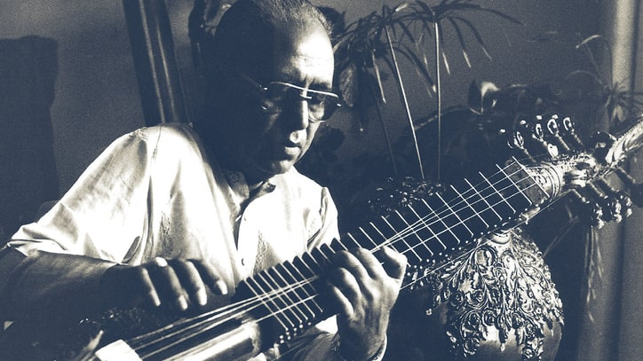

# Instruments of Dhrupad

Dhrupad has a long tradition of both vocal and instrumental music. The instruments associated with Dhrupad are some of the oldest and most revered in Indian classical music.

## Rudra Veena (Been)

The **Rudra Veena** (also called Been in North India) is a large plucked string instrument and the primary solo instrument of Dhrupad. It is known for its deep bass resonance and meditative quality.

### Mythology

The name "Rudra Veena" derives from **Rudra**, an epithet of Shiva — meaning "the veena of Shiva." In Hindu mythology, Shiva is credited as the divine inventor of the instrument, said to have created it as a tribute to the beauty of his consort Parvati. The instrument was considered sacred, believed to possess spiritual powers that could cleanse and purify the mind of both musician and listener.

### History

The oldest preserved portrayal in temple architecture dates from approximately the 5th century A.D., showing a simple, one-stringed instrument with a bamboo cane and a gourd as resonance body. The name "Rudra Vina" first appears in Narada's **Sangita Makaranda** between the 14th and 15th centuries. By the 16th century, the instrument had evolved to its recognizable form with frets and two symmetric resonance bodies.

### Construction

The body (dandi) is a tube of bamboo or teak, between 137 and 158 cm long, attached to two large tumba resonators made from calabash gourds. It has 21 to 24 moveable frets (parda) made of thin brass plates. The standard stringing is four main melody strings and three chikari (drone) strings, though the Dagar tradition uses eight strings for enhanced resonance.

### Ustad Zia Mohiuddin Dagar's Contribution

_(Ustad Z M Dagar in his natural state)_

**Ustad Zia Mohiuddin Dagar** (1929–1990) revolutionized the Rudra Veena through several innovations:

- Designed a larger bass version with bigger gourds and a thicker dandi
- Used thicker steel playing strings with closed javari
- Redesigned the instrument to produce a lower octave matching the human voice
- Introduced playing without the traditional wire plectrum, producing remarkable warmth of tone

His playing technique emphasized **meend** (glides between notes) and **gamak** (subtle oscillations), replicating the nuanced expressiveness of vocal Dhrupad on the instrument. He was known for his slow, meditative development of ragas, typically performed only with tanpura accompaniment.

---

## Pakhawaj

The **Pakhawaj** is a barrel-shaped, two-headed drum and the standard percussion instrument in Dhrupad. Its Sanskrit equivalent is **pakshavadya**, formed from *paksha* ("a side") and *vadya* ("a musical instrument").

### History

The Pakhawaj traces its origins to the ancient **mridangam**, which is still used in South Indian Carnatic music. During the medieval period, particularly from the 13th century onward, the Pakhawaj gained prominence in Hindustani music traditions, as documented in Sarngadeva's **Sangeet Ratnakara**. Under Mughal influence in the 15th–16th centuries, the instrument achieved courtly stature.

### Construction

Originally made of clay, the Pakhawaj is now more commonly made of wood, with two parchment (goatskin) heads, each tuned to a different pitch. The goatskin membranes are looped with leather thongs around the hollowed barrel, which is widest in the middle.

### Playing Technique

The bass face is struck with the whole palm, rather than with fingertips as with the tabla. The treble face is played with varied finger configurations to produce different **bols** (syllabic patterns). The traditional mode uses the whole hand to produce the pure and perfect sound called **chanti**.

### Role in Dhrupad

The Pakhawaj was the only accompanying instrument of the Dhrupad style — for both vocal performances and instruments played in Dhrupad style (Been, Rabab, Sursingar, Surbahar). Its low-register tonal character matches well with the deep registers of Dhrupad vocal and Rudra Veena performance.

---

## Surbahar

The **Surbahar** (bass sitar) is a plucked string instrument used for Dhrupad-style instrumental music. It is essentially a larger, deeper-toned version of the sitar, designed specifically to reproduce the slow alap and jod movements of Dhrupad. Its rich, sustained tone makes it well-suited for the meditative exploration of ragas.

---

## Tanpura

The **Tanpura** (or tambura) is not a melodic instrument but serves as the essential drone accompaniment in all Dhrupad performances. It provides a continuous harmonic reference by sounding the fundamental notes — typically Sa and Pa (or Ma) — creating the sonic canvas upon which the entire performance unfolds. The tanpura's rich overtones are considered essential to the experience of Naad (sound) in Dhrupad.
