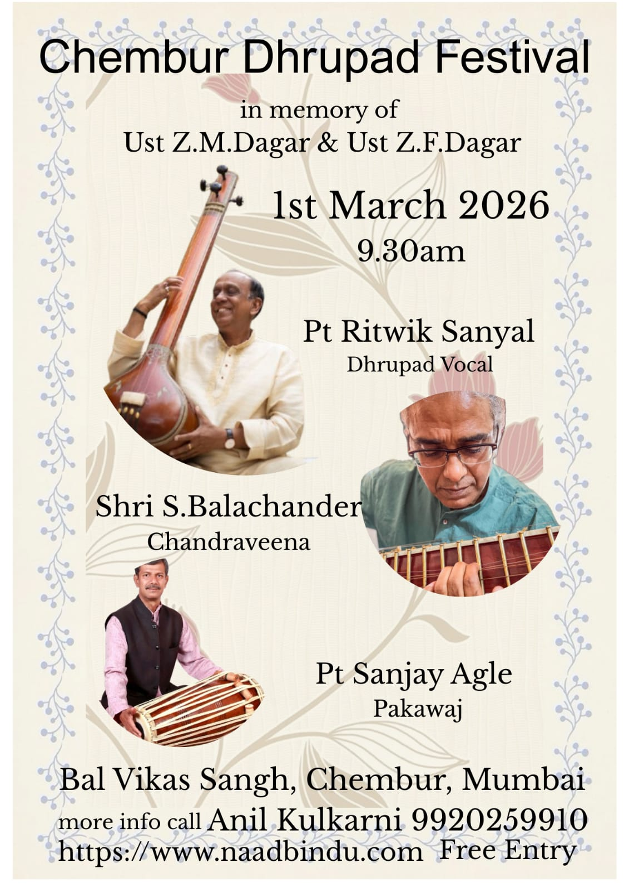

# Chembur Dhrupad Festival 2026

**In memory of Ustad Zia Mohiuddin Dagar & Ustad Zia Fariduddin Dagar**

We are happy to announce the **Chembur Dhrupad Festival 2026**, continuing our tradition of celebrating the rich legacy of Dhrupad music in Mumbai.

## Event Details

|             |                                  |
| ----------- | -------------------------------- |
| **Date**    | 1st March 2026                   |
| **Time**    | 9:30 AM onwards                  |
| **Venue**   | Bal Vikas Sangh, Chembur, Mumbai |
| **Entry**   | Free for all                     |
| **Contact** | Anil Kulkarni — 9920259910       |

## Artists

### Pt Ritwik Sanyal — Dhrupad Vocal

Pandit Ritwik Sanyal is one of the foremost Dhrupad vocalists in India, known for his deep understanding of the Dagar tradition and his dedicated contribution to preserving this ancient art form.

### Shri S. Balachander — Chandraveena

Shri S. Balachander is a distinguished exponent of the Chandraveena, a rare and ancient Indian string instrument. His performances bring out the meditative and profound essence of Dhrupad through the resonance of the veena.

### Pt Sanjay Agle — Pakawaj

Pandit Sanjay Agle is a renowned Pakawaj player whose rhythmic mastery and deep knowledge of the traditional Pakhawaj repertoire complement and elevate every Dhrupad performance.

## About the Festival

The Chembur Dhrupad Festival is an annual event organized by the Indian School of Dhrupad to honour the memory of **Ustad Zia Mohiuddin Dagar** and **Ustad Zia Fariduddin Dagar**, two legendary figures who dedicated their lives to the propagation of Dhrupad music.

This is a completely community-driven initiative. We invite everyone to attend and experience the beauty of Dhrupad. If you wish to support this effort, please consider a donation of any amount.

### Donate

You can donate any desired amount by scanning the QR code below -

**UPI ID:** anil.kulkarni@okicici
