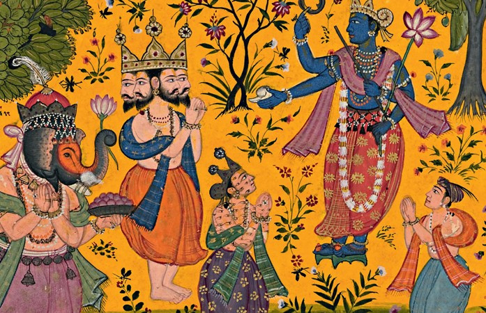

title: Welcome to Naad Bindu!
description: Dhrupad is the oldest and the purest form of Indian Classical Music.

# Welcome!

## Dhrupad - An Introduction

Dhrupad is the oldest and the most ancient form of {==Indian Classical Music==}, it finds its origin in the vedic culture around the Indian sub-continent. Reference for Dhrupad can also be found in the classical text "Natyashastra".

Dhrupad can be presented by both, vocals & instruments, infact there has been a long tradition for **Vani (Vocals)** and **Veena (String Instruments)** to accompany each other.

## Methodology

Dhrupad is presented in four distinct parts, all forming a continuous patterns and part of the entire presentation, the four parts are -

1. **Alaap** - This includes slow exploration of the raag, this is also knows as "Raag Vistaar", meaning you explore the beauty of the raag by expanding one note at a time.

2. **Jod** - The alaap is followed by patterns which are relatively medium paced.

3. **Jhalla** - Jod is followed by fast patterns while maintaining the boundaries of the raag.

4. **Bandish/Gat** - Finally, the presentation is concluded by bandish or gat.

## Characteristic

What makes Dhrupad rather unique is, along with the external expression it also helps to explore your inner dimension, on the surface the music may sound simple or subtle, but it requires a great deal of inner exploration to find the right expressions.

Simplicity can rather be very complicated and also it takes a great deal of efforts to present in a way which feels profoundly simple yet graceful and powerful.

Often, Dhrupad is a form of lifestyle, the essence of music and your daily life go together.

## Naad Yoga

This has been a favourite topic of discussions and research for numerous years, some associate it with occult yogic practices, some associate it with something mystical, some associate it with spirituality from music, etc. So lets try to clarify a lot of misconceptions and understand what it really means.

"Naad Yoga" consists of two words {=="Naad"==} and {=="Yoga"==}, lets try to explore them word by word -

### Yoga -

Yoga has to be understood first as it form the basis of discussion -

    योगश्चित्तवृत्तिनिरोधः ॥२॥
    yogaś citta-vṛtti-nirodhaḥ
    — Yoga Sutras 1.2

What it means is, in essence, __Yoga is the natural cessation (nirodhaḥ) of the modifications (vṛtti) of the mind (citta)__. There are various methodologies of achieving this state, e.g Ashtang Yoga, Hath Yoga, Naad Yoga, etc.

### Naad

Naad literally means "Sound", so essentially {==Naad Yoga==} is one form out of many methodologies to achieve "Yog" (State of Yoga).

Naad Yoga primarily explores the medium of sound (Naad) to reach this ultimate goal.

## Rasa

Rasa refers to "sentiments" or "mood" and it forms an integral part of Dhrupad presentation, rasa comes in various flavours.

According to the Nāṭyaśāstra chapter 6.15, the eight sentiments (rasa) recognized in drama are as follows:

    1. śṛṅgāra (Decorative or erotic),
    2. hāsya (Humor),
    3. karuṇa (Pity),
    4. raudra (Furious),
    5. vīra (Heroic),
    6. bhayānaka (Terrible),
    7. bībhatsa (Odious),
    8. adbhuta (Marvellous)

While Dhrupad explores all types of rasa, but often hāsya (Humor), bhayānaka (Terrible) and bībhatsa (Odious) are left out for obvious reasons.

This is one aspect that makes Dhrupad or Indian Classical Music rather unique, the artist is free to improvise and explore any rasa while maintaining the sanity of the raag. 

Thus any one raaga can be often presented in multiple rasas, all depending on the artist and every expression is equally valid!
